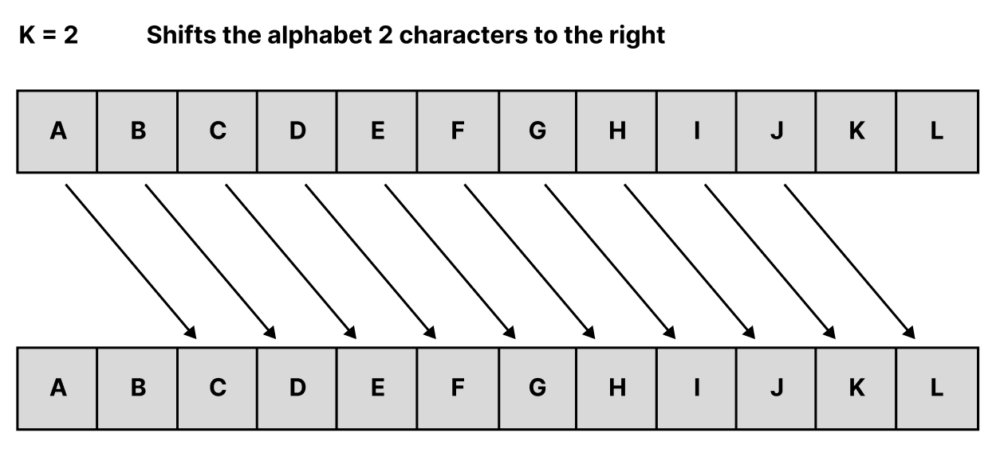

# Caesar Cipher
We will build a project where our programme will encrypt or decrypt a user message. Caesar ciphers use a substitution method where letters in the alphabet are shifted by some fixed number of spaces to yield an encoding alphabet. A Caesar cipher with a shift of 1 would encode an A as a B, an M as an N, and a Z as an A, and so on. So we will ask user to choose between "encode" and "decode" and then enter a message and shift number. Finally, we will encrypt the message and display it.

### Prerequisites
 - Familiarity with Python basics such as while loop and methods.
 - An IDE such as VS Code, Pycharm(I use VS code for this project)

### Objectives
   - Learn more about lists, list indexes and while loop.

### Steps to follow:
1. First, import `string` module to get a string of alphabet in lower case.
2. Create a method named `caesar_cipher` which takes 3 arguments:
    - user choice for encode or decode
    - user message to encrypt/decrypt
    - number of shift
3. Iterate over the message and check if each element exist in the alphabet list. If so, find the index number of the element and shift it by number of shift that user entered.If user chooses encode,the alphabeth rotate right by number of shift. If user chooses decode, the alphabeth will rotate left by number of shift.
4. Create a new list and add the shifted element in the list.
5. If the element doesn't exist in the alphabet list. This could be either a symbol like "!#" or space, in that case, return same element in the same position without shifting it and add it to new list  with all the other shifted elements.
6. To use the method, first ask user make a choice between encode and decode. Then, ask user to enter a message and number of shift. Display the encrypted/decrypted message on the console. 
7. Ask whether they like to continue and if the answer is yes, use a loop type to continue else stop the programme.
8. You will also notice that you get `list index out of range` error when the loop iteratres over the alphabet when the number of shift goes beyond letter `z` as it is the last element of the alphabeth list. To solve this issue, you could simply copy another list of the alphabet and added to existing alphabeth list but if the user enters 1000 or 10000 as the number of shift, what would you do? (**Hint** Check https://stackoverflow.com to solve this problem)
**The final result should look like this:**
