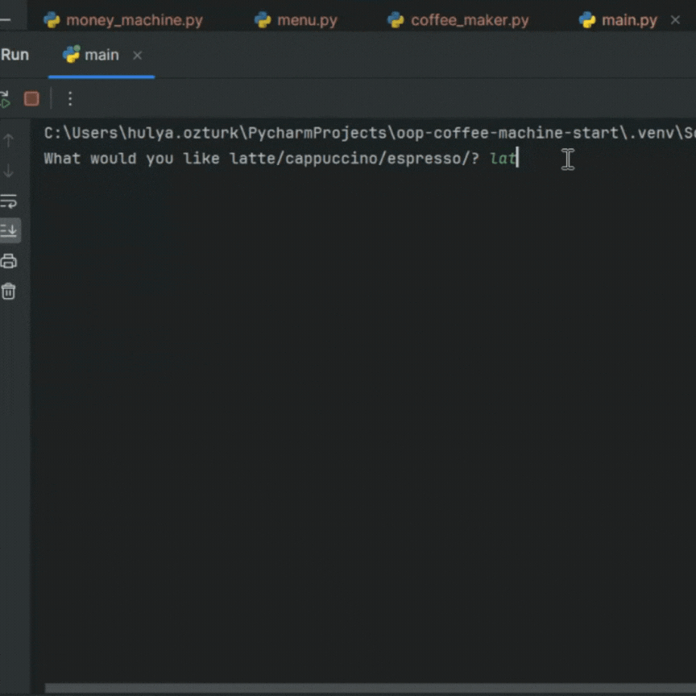

# Coffee Machine
The objective of this game is to build a coffee machine where a user will be able to order a coffee, pay for their order and get their change back.
### Prerequisites
 - Familiarity with Python's OOP concepts
 - An IDE such as VS Code, Pycharm(I use Pycharm for this project)

### Objectives
   - Learn more about classes which enables us to create objects and give each object different attributes and behaviours
   - Find more about importing a class from another file/module in Python.

### Steps to follow:
1. Create the class of ```MenuItem```. This class will have 3 attributes: `name`, `cost` and `ingredients`. `Ingredients` itself will be a dictionary where we will store key-value pairs: `water`,`milk` and `coffee`. 
2. Create another class named ```Menu``` that will have a list of 3 menu items using ```MenuItem```class 
  - ```python
     [MenuItem(name="latte", water=200, milk=150, coffee=24, cost=2.5),
      MenuItem(name="cappuccino", water=250, milk=50, coffee=24, cost=3),
      MenuItem(name="espresso", water=50, milk=0, coffee=18, cost=1.5)]
  - We will have two methods in the ```Menu``` class:
    - ```get_items()``` where it returns the names of menu items available.
    - ```find_drink()``` where it takes an order as a parameter and search for it in the menu items available. Returns the item if available, returns "Not available" if not.
4. Next, create a class named ```MoneyMachine```:
   - In this class, we will have two constant variables, first one is the currency(dollars), the  second one is a dictionary for the coin values("quarters": 0.25,
        "dimes": 0.10,
        "nickels": 0.05,
        "pennies": 0.01)
   - ```MoneyMachine``` class will also have two attributes for the profit and money received from the customer.
   - We will create two methods in this class:
      - ```report_profit()``` which prints the profit
      - ```process_coins()``` which returns the total calculated from the coins inserted.
5. Create a class with name ```CoffeeMaker``` which models the machine that makes coffee.
   - This class will have a dictionary attribute called `resources` which have 3 key-value pairs: `water:300`,`milk:200` and `coffee:100`
   - We will also create three methods in this class:
        - ```report()``` which prints a report of resources
        - ```is_resources_sufficent()``` which will return True if the resources sufficent and False if not.
        - `make_coffee()` that will deduct the required ingredients from the resources.
6. Finally, create `main.py` where we are going to import the classes created above and we will start building the coffee machine where a user can make a choice among the options given.

The final result should look like this:
