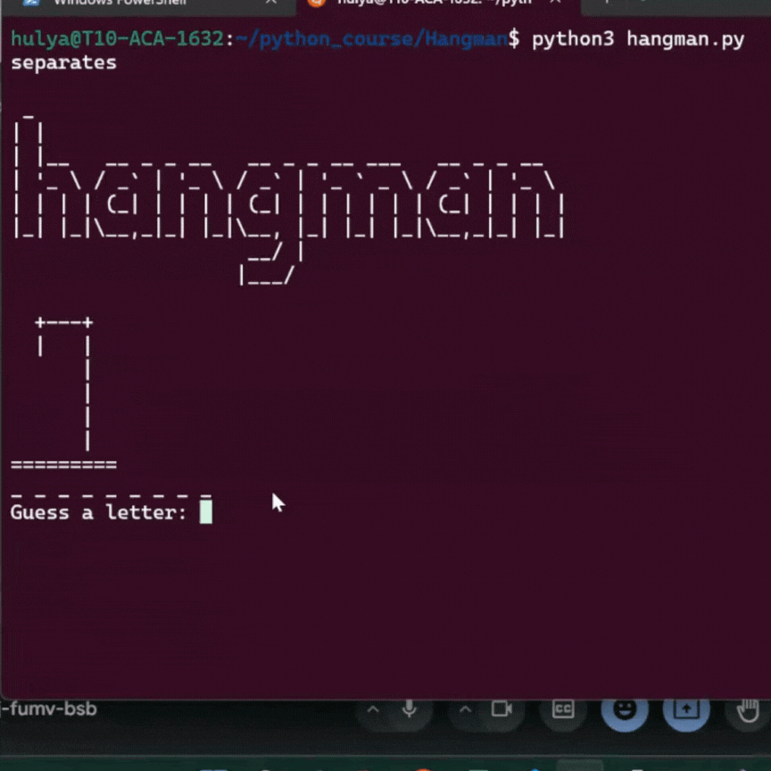

# Hangman
We will build an interactive Hangman game, in which the participant has to guess a word, letter by letter, until it runs out of life or guess the word correctly.

### Prerequisites
 - Familiarity with Python basics such as while loop and methods.
 - An IDE such as VS Code, Pycharm(I use VS code for this project)

### Objectives
   - Learn more about opening '.txt' file extensions, looping types as well as random, os and time modules.

### Steps to follow:
1. First, copy `words_list.txt` and `hangman_art.py` files into working directory in your local machine. Create a `main.py` and import these two files into `main.py`.
2. Define a method to create a list of words from words in `words_list.txt` file. (**Hint** Check `with open` in Python)
3. Using random module, choose a random word in list of words.
4. Iterate through random word and replace each item with "_" in random word. Add these to a newly created empty list and name it `secret_word`.
5. Next, display `HANGMAN` and the first item in `HANGMANART` on the console. Then, ask the player to guess a letter. 
6. Define a method to check if the guessed letter exists in random word. If so, replace `"_"` in the same position as the letter with guessed letter in `secret_word` list just created above. 
7. Outside the method, if the guessed letter is not in random word, firstly, declare a variable named `wrong_guess_count` and increment it by 1. We will also need update `HANGMANART` with every wrong guess.(`HANGMANART[0]` shows an empty gallows, `HANGMANART[1]` shows the head (when the player misses one letter), `HANGMANART[2]` shows the head and body (when the player misses two letters), and so on)
8. As we continually want to ask the player to guess a letter until they guess the whole word correctly or they run out of lives, we will put our code in a loop.
9. Next, create an empty list where all the letters guessed by the player will be added. If a letter is being entered by the player more than once, a warning message should display on the console.
10. If the player guesses the random word correctly, display a message telling the player they won the game and break the loop.
11. If the wrong guesses count equals to the length of `HANGMANART` list, then display the random word and break the loop.
12. Finally, to stop the console looking too cluttered, we clear the screen after a guess. After every clear, `HANGMAN`, `HANGMANART` and `secret_word` should be display back on the console.(**Hint** Find more about `os` and `time` modules about clearing the console and delaying the clearing process.)
**The final result should look like this:**
