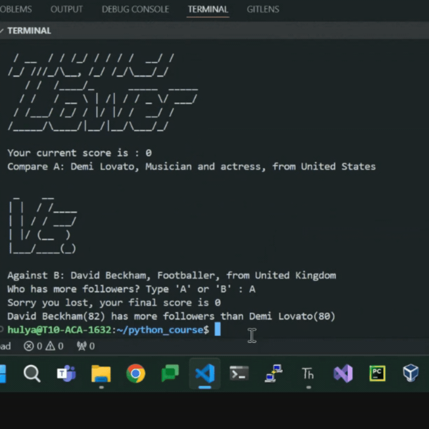

# Higher vs Lower
We will build a game where we going to compare two instagram accounts and try to find the one with the higher followers.
### Prerequisites
 - Familiarity with Python basics such as while loop, random module.
 - An IDE such as VS Code, Pycharm(I use VS code for this project)

### Objectives
   - Learn more about dictionary data type and accessing dictionary items.

### Steps to follow:
1. Firstly, we will create an ascii art for the title of the game. You can either copy the one in art.py in this folder or create a new one from this webpage : https://www.asciiart.eu/text-to-ascii-art 
2. Next, we will create `main.py` and import the `data` from `data.py`. `data` is a list of dictionaries. Each dictionary in the list consists of `name`, `follower_count`, `description`, `country` keys and each key holds a different value depending on the instagram user.
4. After importing `data`, we will shuffle the order of list. This way, we will get a different account data to compare. 
5. Then we configure the account data into a printable format. Get `name`, `description` and `country` values from the randomly chosen account data and format it such as example below: 
   
   ```Compare A: Shakira, Musician, from Colombia```
   
   ```Against B: Dwayne Johnson, Actor and professional wrestler, from United States```
6. Add the versus ascii art in between `A` and `B`
6. After formatting the data for two randomly chosen accounts, we will ask the user to guess whether `A` or `B` account has more followers. If the user guess it right, the `score` will increment by one. The `score` will be displayed with every round. 
7. Next challange to tackle is to move the account at position `B` to position `A` to start next round
8. Finally, we will put the whole block of code in a loop, so that the user keep getting random accounts displayed for comparison until they guess it wrong. When the user guess it wrong, the loop will stop and it will display the final `score`.
9. If you notice in the final result gif below, the screen clears whenever a new round starts, we address this with a function in the module `os`.
**The final result should look like this:**
