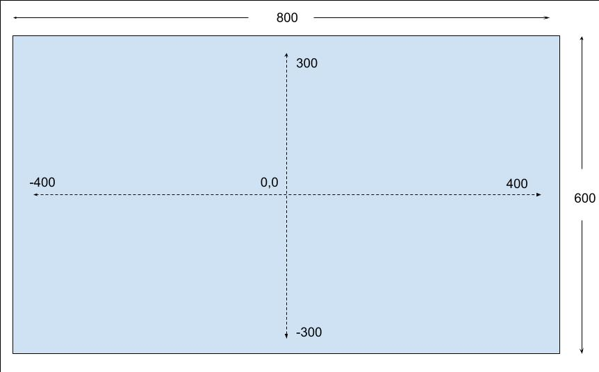
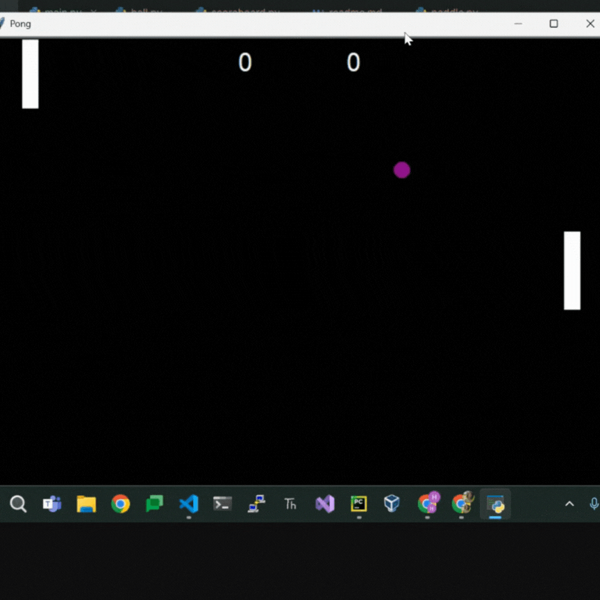

# Pong
**Intermediate**

We will build the game Pong which consisted of two paddles that players used to volley a small ball back and forth across a screen

### Prerequisites
 - Familiarity with Python basics such as classes, class inheritance and methods.
 - An IDE such as VS Code, Pycharm(I use Pycharm for this project)

### Objectives
   - Learn more about turtle module, class inheritance and methods.

### Steps to follow:
1. First, start with setting up the main screen by setting width to 800 and height to 600. Set background color to black and give it the title `Pong` in the `main.py`.
2. Create a class named `Paddle` and import `Turtle` module.
    - Create a paddle object with size of 20px in width, 100px in height and in white color.
    - Define a method to make paddle to go up and another method to make it go down.
3. Import `Paddle` class back in `main.py` and create 2 paddle objects. Make one positioned right by setting x coordinate to 350, y coordinate to 0 and the other one positioned left by setting
x coordinate to -350 and y coordinate 0.  
4. By using screen events, make right paddle to go up pressing `"Up"` key and down `"Down"` on the keyboard.
5. Next, create another class named `Ball` and import Turtle module to inherit properties and methods to create ball object.
   - Create a ball object using turtle circle shape
   - Define a method named `move_ball()` that will make the ball move towards top right corner.(**Hint** Increase x-axis and y-axis by a certain number)
   - To detect the collision of the ball with both top and bottom walls, define another method named `bounce_y_axis()`. This method will take ball's current y_axis and decrement it by one if it hits to top wall or increment it by one if it hits the bottom wall.
   - We also need to address the collision of the ball with paddles. Create a method called `bounce_x_axis()`. This method will do the same thing as `bounce_y_axis()` but this time ball's current x-axis will increment or decrement by one if its distance to the paddle smaller than a certain number. 
     
   - Next, everytime a paddle misses the ball, the ball should go back to the same position it started which 0 in x-axis and 0 in y-axis. For this, define another method named `reset_position()`
6. The paddle on the left side will be moving up and down continuously whereas the right paddle is being controlled by the player with `Up` and `Down` keys on the keyboard. To be able to make the left paddle move, first define a method in Paddle class and name it `move_paddle()`. 
This method enable to move the left paddle up and down in y-axis.
7. When we call the method `move_paddle()` in `main.py` and put it in a while loop, you will notice the paddle moves one way continuously. What we want is when the paddle reaches the top position(260) or the bottom position(-260) in y-axis, it should bounce back and start moving in the opposite direction. To address this issue, define a method in `Paddle` class. 
This method will take left paddle's current y_axis and decrement it by one if it hits to top wall or increment it by one if it hits the bottom wall.
8. Lastly, to track to score, create a class named `Scoreboard` which inherits from `turtle` module. In this class, define a text object using turtle's `write()` method. 
   - Create a method called `update_score()` which increment by one when a paddle misses the ball.

**The final result should look like this:**

