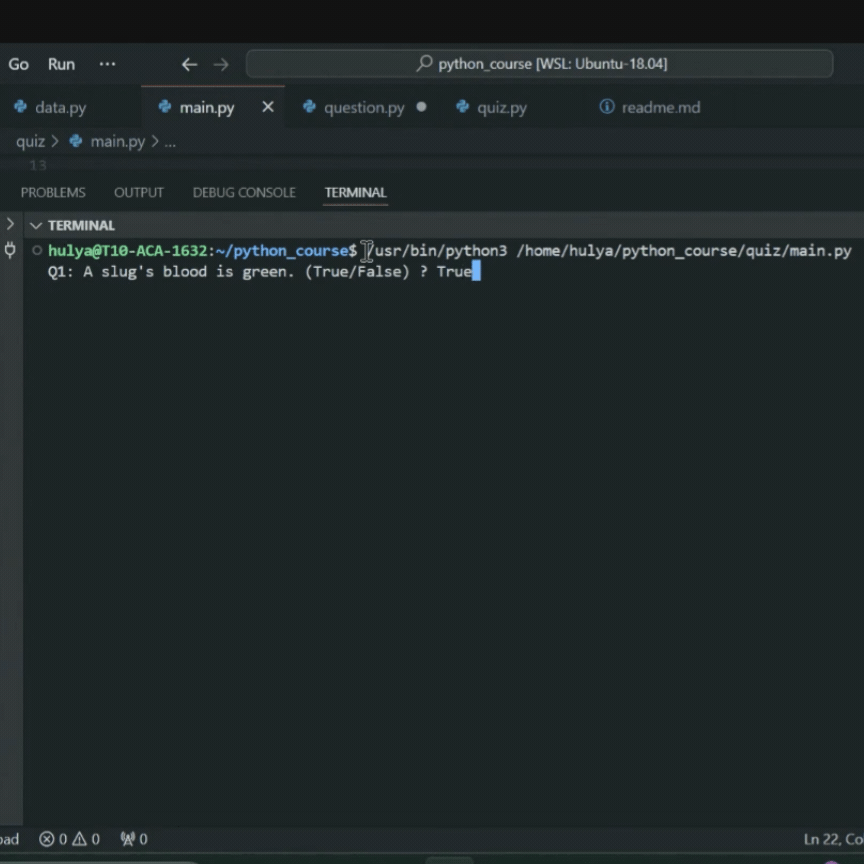

# Quiz
We will build a true-false quiz game, completely using Object Oriented Programming
### Prerequisites
 - Familiarity with Python's OOP concepts
 - An IDE such as VS Code, Pycharm(I use VS code for this project)

### Objectives
   - Learn more about classes which enables us to create objects and give each object different attributes and behaviours
   - Find more about importing a class from another file/module in Python.

### Steps to follow:
1. Firstly, we will import the `question_data` to `main.py` from `data.py`
2. Next, we will create class named ```Question``` which will have 2 attributes `question` and `answer`. This class will give us the ability to create Question objects using the data from data.py. 
3. Import `Question` class to the `main.py` and create a list of question objects using the data provided by `data.py`
4. Create another class name `QuizBrain`. This class will have all quzzing and questioning functionality. 
   - This class will have three attributes: `question_number`, `question_list` and `score`.
   - Create `check_answer()` to check the correct answer. If the user answer is correct increment the score by one and print the score and the number of questions asked.
   - Create another method called `next_question()`. This method will take a list of questions. Starting from the first question, it will ask the user for an input : True or False. Next, we will call `check_answer()` method inside `next_question()` method and will check if the answer given is corret.
   - Lastly, we create a method to check if there are any more questions. We will name this method `still_has_questions()` which will return a boolean value and we will call it in `main.py` to get questions being asked.

The final result should look like this:
