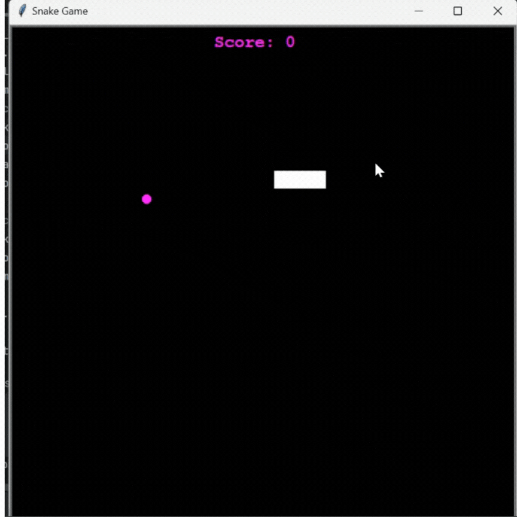

# Snake
We will build the game, Snake. Everyone who/whose parents owned a Nokia 3310 phone surely knows how to play this retro arcade game
### Prerequisites
 - Intermediate level of familiarity with python module turtle
 - An IDE such as VS Code, Pycharm(I use VS code for this project)
 - Ensure that you have version 3 of Python on your computer.

### Objectives
   - Learn about classes and class inheritance in Python
   - Find more about how directions and coordinates works in turtle library.

### Steps to follow:
1. Firstly, we will set up the canvass using `Screen()` class. Set the size 600 x 600 pixels and change the background colour to black. Also add the title 'Snake Game' to appear on top of the window.
2. Next, we will define a class named `Snake` in another page. In this class:
   - Create a list of three turtles in square shape and align each squares next to each other (the size of each square is 20px). We will do this with creating a `create_snake()` method.
   - After forming the snake body with three squares, create a method called `move()`. This method will make the snake go forward. Also, we will address the issue with turning where last and last to the second squares will follow the first one along. The logic here is to make 3rd square move to position of 2nd square and 2nd to position of 1st square and then make 1st square to go forward 20 paces.
3. Create a snake object by importing Snake from `Snake` class and then figure out how to move it continuously (**Hint**: check out loops in Python)
4. You probably notice the snake body is not moving exactly how we imagined and a line being drawn when it moves. This is an easy problem to fix(**Hint** Check out Pen Control part in turtle graphics Python documentation) 
5. You will also notice that when you turn the snake right or left, you see the head of the snake make that 90-degree turn independently from the rest of its body. To address this issue we need to control the animation. We also need to slow it down using `time` module.(**Hint** Check out `tracer()` and `update()` methods in turtle graphics Python documentation)
6. Next, define four methods to make the snake turn left, right, up and down using screen events. Create these methods inside `Snake` class and make sure the snake won't be able to go down when it is going up or vice versa and go left while it going right or vice versa.  
7. After forming the snake, create `Food` class. This class will inherit from Turtle class. In this class:
   - Define a constructor that will inherit from Turtle class and create circle in any color you like.
   - Position the circle in a random place on the canvas.
8. Create an object of Food in the `main.py`. To detect the collision of snake with food, we need to check the distance between two objects (**Hint** Check Turtle's state methods in turtle graphic documentation)
   - If the distance is more than 15px, there will be a collision.
   - Next thing to do is make the circle disappear and appear in a random place on the canvas every time it collides with the snake head.
     - To make the circle reappear in a random place , we go back to `Food` class and create a method named `refresh()` which will make the food object reappear in a random place on the game canvass.
9. After solving the problem with snake-food collision, we need to create a scoreboard which keeps track of the score. The score should update every single time snake hit the food.
10. For scoreboard, create a class called `Scoreboard`. This class will inherit from `Turtle` class like we did with `Food` class. Inside this class:
    - Create a turtle object for our scoreboard which will display the score on the canvass(**Hint** Check out `More drawing control` section in turtle graphics documentation)
    - Define a method named `update_score()` where the score will increment by 1 every time snake head hit the food.
11. As you would all remember, every time snake eats food, it gets longer. What we need to do is create a method where the snake will extend 1 segment and that segment will be added to the last segment of the snake body(**Hint** To be able to do that you might need tweak `create_snake()` method a bit and create another method named `add_segment()` which will create only a single segment)
12. Next problem to address is make the game over when the snake head collides with the wall or with its own body. We will create 2 methods for these two problems inside `Snake` class.
   - Name the first method `is_wall_in_front()`. This method will return a boolean value.(**Hint** Remember that x coordinate is -300, 300 and y coordinate is -300, 300 for 600x600 canvass)
   - Call the second method `collide_with_itself()`.This method will also return a boolean value. Excluding the first segment(head) of the snake, if snake hit any other segment in the snake body, it will return True.
13. Lastly, we create a method named `game_over()` in `Scoreboard` class. This method will display a 'Game Over' message in the middle of the canvass if the snake collides with itself or hits the wall.
**The final game should look like this**:

