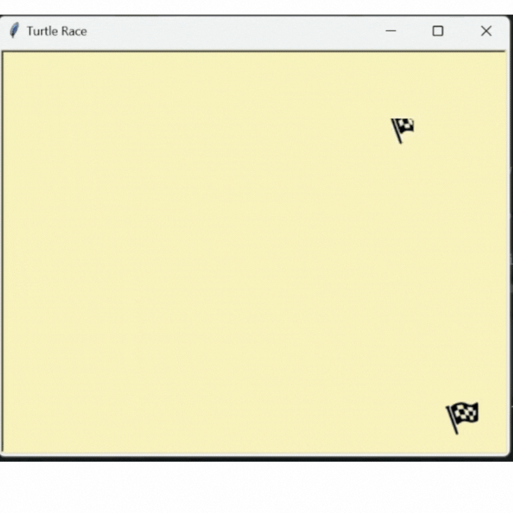

# Turtle Race
The objective of this game is to build a turtle race
where multiple turtles running to the finish line first.
### Prerequisites
 - Basic knowledge of Python
 - ```Install turtle module```. Turtle module is a pre-installed Python library that enables users to create pictures and shapes by providing them with a virtual canvas.
    - ```pip install turtle```
 - Download an IDE such as VS Code, Pycharm(I use Pycharm in my case)

### Objectives
   - Creating multiple turtles from the blueprint of Turtle class and giving them each different appearances such as color and behaviour.
   - Applying recursion technique where we are going to call ```start_race()``` method within itself to restart the game.

### Steps to follow:
Please check python turtle documentation to get yourself familiarize with the module : https://docs.python.org/3/library/turtle.html#introduction
1. Set the size of the canvas with ```width = 500``` and ```height = 400``` and give it the title of ```Turtle Race```
2. Import ```finish-flag-32.gif``` and create 2 flags to position first one at the right top corner and second one at right bottom corner to mark the finish line (**Hint:** To understand the x, y coordinate system better, have a look at the ```coordinate-x-y-axis.jpg``` image.)
3. Create a list of 6 different colors. Create 6 turtle objects using ```Turtle()```class and apply each a color in the ```colors``` list. 
4. Next step is to  a ```start_race()``` method to set the game logic where each turtle will be racing against each other.
   - Firstly, we will ask user to make a guess about the winner. (**Hint:** Check ```Input Methods ``` section in the Python Turtle documentation)
   - Next, we will position the turtles at the start line, giving a space of 40px between each. (**Hint:** Check ```goto()``` method in the documentation)
   - Using a while loop, we will make turtles to start racing each with a random speed. (**Hint:** Check ```forward()``` method in the documentation and find more about ```random``` module)
   - When they reach to the finish line which is between 200 - 250px considering the size of each turtle is 40x40, detect the first turtle that reached the mark.
   - After detecting the winning turtle, we inform the user whether they win the game or not.
   - Next thing we do is to ask the user if they would like to play the game again. If they like play again, we restart the game.(**Hint:** Find more about recursion in python.)
The final game should look like this:
